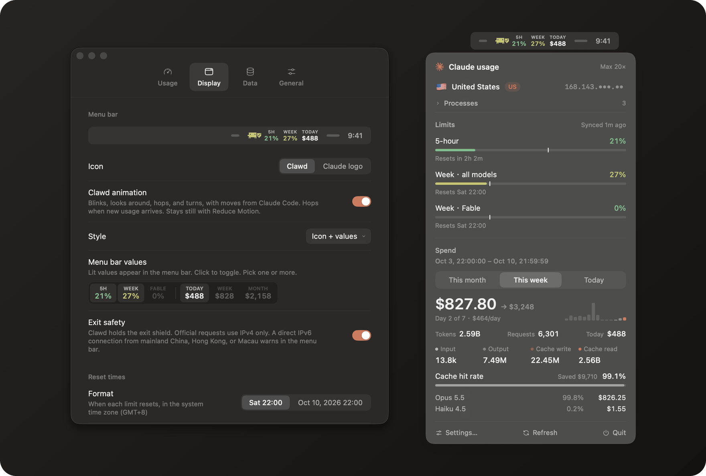
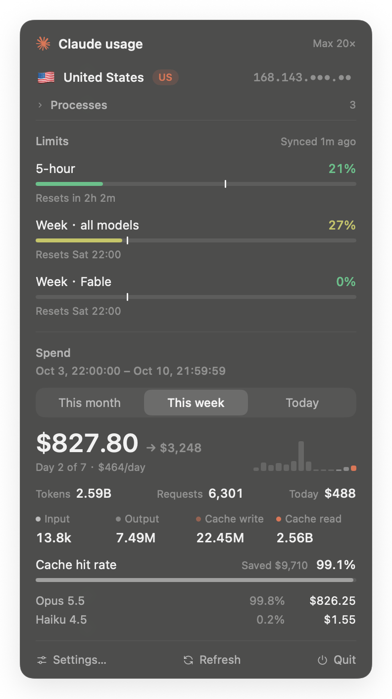
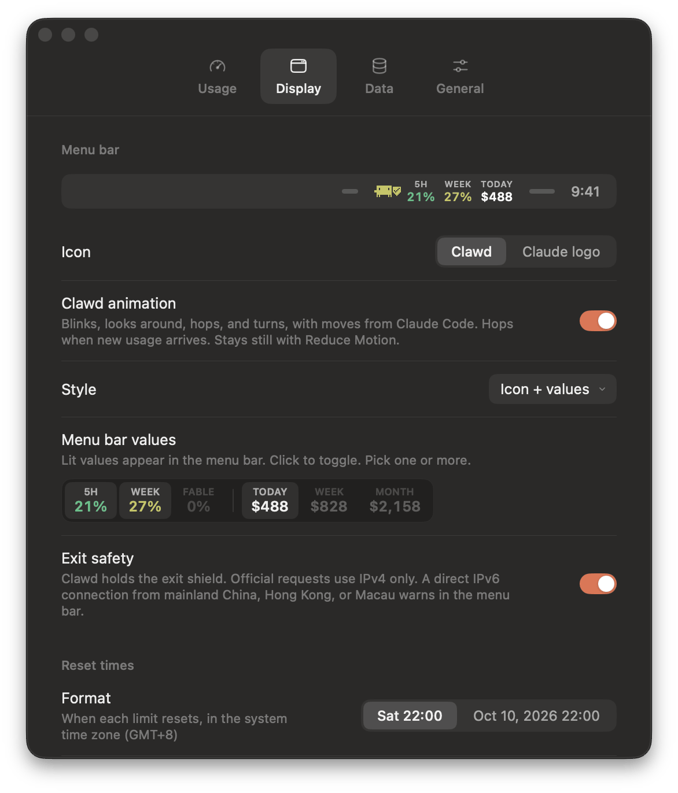
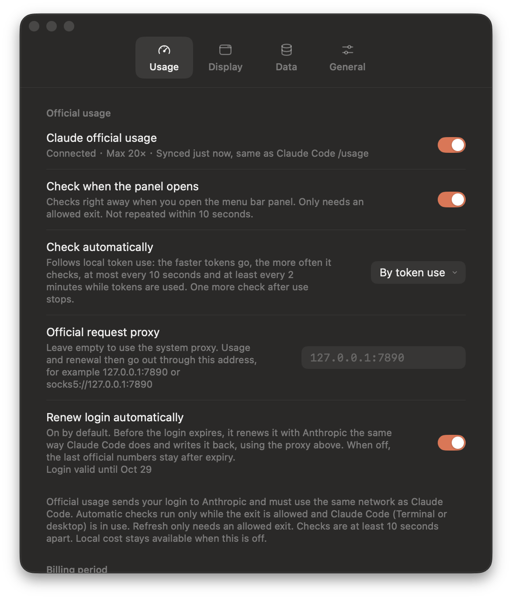

<div align="center">


# Claude Usage Monitor

**Your exact Claude limits, right in the menu bar.**

The same 5-hour and weekly numbers as Claude Code `/usage`, kept current while you work,<br>
plus what your Claude Code sessions would cost at API prices. Native, private, and quiet.

[](https://github.com/kittors/claude-usage-monitor/releases/latest)
[](#install)
[](Package.swift)
[](LICENSE)

[**Download**](https://github.com/kittors/claude-usage-monitor/releases/latest) · [中文说明](README.zh-CN.md) · [Changelog](CHANGELOG.md)

<br>



</div>

<br>

## Highlights

<table>
<tr>
<td width="50%" valign="top">

**Official numbers, never estimates**<br>
5-hour, weekly, and per-model limits come straight from the endpoint behind Claude Code `/usage`, rounded the same way.

</td>
<td width="50%" valign="top">

**A menu bar that says what it shows**<br>
5-hour by default. Add the week, Fable, or cost, and each value gets its own compact column with a small label, colored by how full it is.

</td>
</tr>
<tr>
<td valign="top">

**See a limit coming**<br>
A safe line on the 5-hour and weekly bars shows how much can be used by now and still last until the reset. The 5-hour line follows the clock; the weekly line adds a seventh each day. Usage past it turns red, and pointing at a bar shows the line and what is left.

</td>
<td valign="top">

**Clawd keeps watch**<br>
Clawd holds the exit shield in its own pixel style and color, and the shield turns red when the exit is not safe. It blinks, looks around, and hops, with moves taken from Claude Code.

</td>
</tr>
<tr>
<td valign="top">

**Checks when it matters**<br>
Only while Claude Code is in use and usage is enough to move the numbers, at most one check every 5 minutes on average, so it stays clear of rate limits. Opening the panel refreshes right away when the numbers may have moved.

</td>
<td valign="top">

**Knows its way out**<br>
Confirms the exit Anthropic sees before every request, pauses in mainland China, Hong Kong, or Macau, and warns if IPv6 goes out directly.

</td>
</tr>
<tr>
<td valign="top">

**Spend you can read**<br>
API-equivalent cost for this week, the billing month, or today, with a projected total at the current pace, the token mix, cache savings, a per-model split, and a 14-day trend.

</td>
<td valign="top">

**Stays signed in**<br>
Renews the Claude Code login the way Claude Code does, with the same locks, so the numbers never go stale. Shows running Claude sessions too.

</td>
</tr>
</table>

## Screenshots

<table>
<tr>
<td width="40%" align="center" valign="top">
<br>
<sub><b>The panel</b> · limits with safe lines, spend, and processes</sub>
</td>
<td width="60%" align="center" valign="top">
<br>
<sub><b>Settings › Display</b> · pick what the menu bar shows</sub>
</td>
</tr>
<tr>
<td colspan="2" align="center">
<br>
<sub><b>Settings › Usage</b> · when to check, proxy, login renewal</sub>
</td>
</tr>
</table>

## Install

Download `ClaudeUsageMonitor-<version>-macOS.zip` from the [latest release](https://github.com/kittors/claude-usage-monitor/releases/latest), unzip it, and move **Claude Usage Monitor.app** to Applications. macOS 15 or later.

The build is not notarized, so macOS may block the first open. Choose **Open Anyway** in **System Settings › Privacy & Security**, or run:

```bash
xattr -dr com.apple.quarantine "/Applications/Claude Usage Monitor.app"
```

For the limits, sign in to Claude Code on this Mac once (`claude auth login`). After that the app finds the login by itself, and updates install from **Settings › General**.

## How it works

<details>
<summary><b>Limits come from Claude, not from a guess</b></summary>
<br>

The app reads the Claude Code login from the keychain and calls `GET https://api.anthropic.com/api/oauth/usage`, the endpoint behind Claude Code `/usage`. Percentages are rounded down the same way: 71.9% shows as 71%. A failed sync keeps the last official values and says when they were fetched. With no successful sync yet, the panel explains why and leaves the percentages blank.

</details>

<details>
<summary><b>When it checks</b></summary>
<br>

The endpoint is rate-limited, and every Claude client on the account shares the same allowance: after twenty or thirty requests in a row it returns HTTP 429 without saying how long to wait. So the app asks only when the numbers can have moved:

- The official percentages are whole numbers and change one point at a time. From the current window itself (local usage in the window at the last sync ÷ the official percentage), the app works out how much local usage moves a percentage by one point, and checks once that much has been used. When Claude Code pauses for 15 seconds between turns, it also checks once about a third of that has been used. While a window is still at 0%, it asks again once the window's usage has doubled. This estimate only decides when to check. The numbers shown still come only from the official endpoint.
- While tokens keep going, it checks at least every 15 minutes, which catches usage on other devices.
- It checks only while Claude Code is in use (a session is running in Terminal or in the desktop app and used tokens in the last 5 minutes) and tokens were used since the last sync, with at least **Settings › Usage › Interval** between checks (30 seconds by default, anywhere from 10 seconds to 1 hour).
- All requests share one budget that survives restarts: about one every 5 minutes on average, a few in a row after a quiet spell, and one always kept for **Refresh**. If a 429 still comes back, the budget empties and checks back off for 5 to 30 minutes.

Replaying a heavy morning, the old pacing sent 126 requests in two hours, and 115 of them came back unchanged. The new pacing sends 25, and new numbers show up about a minute and a half after they change.

At launch, after wake, and when the exit becomes allowed again, it checks once if Claude Code is in use. When a limit reaches its reset time, it drops to 0% in the panel and the menu bar on the spot, without waiting for a check. Opening the panel checks right away when usage since the last sync may have moved the numbers (**Check when the panel opens**, on by default), and the refresh icon keeps turning until the new numbers arrive.

</details>

<details>
<summary><b>The exit check</b></summary>
<br>

Before each request the app asks `api.anthropic.com` which exit it sees, over the same connection the request will use. If that check fails, or the exit is in mainland China, Hong Kong, or Macau, nothing is sent. Official requests use IPv4 only. If an IPv6 connection to Claude goes out directly from one of those regions, the panel and the menu bar show a severe warning. This check before a request runs in the background, and the shield stays as it is. The panel checks again when the route, a network interface, or the system proxy changes, and does not poll in between. Then, if the exit was safe, the menu bar shield turns red while the check runs: three dots light up in turn on the shield Clawd holds, or a short arc spins in the shield beside the Claude logo. A risky exit keeps its warning until the result arrives. Without an IPv6 route the IPv6 probe ends at once, so a check takes about 0.7 seconds.

</details>

<details>
<summary><b>Login renewal</b></summary>
<br>

A Claude Code access token lasts about 8 hours, and only the Claude Code CLI refreshes it. The desktop app uses a different login, so this keychain item goes stale if you never run the CLI. With **Renew login automatically** (on by default), the app renews it about 5 minutes before expiry, exactly as Claude Code does:

- It takes the same locks (`~/.claude/.oauth_refresh.lock`, `~/.claude.lock`, `~/.claude/.storage-write.lock`), so it never refreshes at the same time as Claude Code.
- Refreshing invalidates the previous refresh token, so the app first checks that the keychain item can be written, then writes it and reads it back.
- Only the `claudeAiOauth` tokens are replaced. Everything else in the item, including MCP server logins, stays as it was.
- If Claude Code refreshes or signs in during the attempt, the app keeps that result.

The login itself also expires, on the date shown in Settings. After that, or after you sign out elsewhere, the panel offers **Sign in with Claude Code in Terminal**, which runs `claude auth login`.

</details>

<details>
<summary><b>Cost and tokens</b></summary>
<br>

Session logs under `~/.claude/projects/**/*.jsonl`, including sub-agent logs, are parsed incrementally.

- A streaming message is written as several lines, and the middle lines only carry a partial `output_tokens`. Rows are deduplicated on `message.id` plus `requestId`, keeping the final count.
- Prices follow the published list: 5-minute cache writes at 1.25x, 1-hour cache writes at 2x, and cache reads at each model's rate.
- The totals match Claude Code's own `cost-state` records.

The week follows the official weekly `resets_at`, to the second. The billing month uses your billing day on the same clock. Today is the local calendar day. These logs cover Claude Code on this Mac only, while claude.ai, the mobile apps, and other computers still count in the official percentages.

</details>

## Privacy

- Credentials stay in memory and go only to Anthropic: `api.anthropic.com` for usage, `platform.claude.com` to renew the login. They are never logged.
- The keychain item `Claude Code-credentials` is read and written with `/usr/bin/security`, the same way Claude Code does it. That item trusts `security`, and each rewrite by Claude Code resets other apps' access, so going through the Keychain API would ask for your password after every renewal.
- With automatic renewal off, the app only reads the login.
- Session logs never leave this Mac.

## Build from source

macOS 15 or later and Xcode 16 or later (Swift 6 toolchain).

```bash
make app       # build/Claude Usage Monitor.app (release)
make install   # build and copy to /Applications
make run       # build and launch
make dev       # debug build, and open the panel
make test      # unit tests
make dist      # zip for a release
```

The build script signs with an Apple Development certificate when one is available and falls back to ad-hoc signing. `CODESIGN_IDENTITY` overrides it. **Launch at login** uses `SMAppService`, so run `make install` before turning it on.

<details>
<summary><b>Releasing</b></summary>
<br>

1. Add `## [x.y.z] - YYYY-MM-DD` at the top of `CHANGELOG.md`, in English.
2. Run `make release VERSION=x.y.z`. It runs the tests, sets the version, tags, and pushes.
3. `.github/workflows/release.yml` builds the zip from the tag and publishes the release with the matching changelog section.

</details>

<details>
<summary><b>Performance</b></summary>
<br>

The first launch indexes every log, about 5 seconds for 5 GB and roughly 840,000 lines. After that:

- The index is a compact binary in `~/Library/Application Support/ClaudeUsageMonitor/` that loads in about 20 ms.
- FSEvents watches the log folders and only new bytes are read, about 40 ms per update.
- Spend figures take about 60 ms to compute, and the index keeps history after Claude Code deletes old logs.

</details>

<details>
<summary><b>Project layout</b></summary>
<br>

```
Sources/
  UsageCore/                 data layer, no UI, unit-tested
    TokenParser.swift        incremental JSONL parsing, fast ISO 8601
    UsageIndex.swift         dedup, session metadata, file cursors, binary cache
    UsageCalculator.swift    week, billing month, today, daily trend
    OfficialUsage.swift      usage endpoint model
    AutoSync.swift           when to check official usage
    ClaudeOAuth.swift        credential parse, refresh request, write-back merge
    CredentialRenewal.swift  lock, re-check, write preflight, read-back
    DirectoryLock.swift      directory lock compatible with Claude Code
    Pricing.swift            model price list
    Formatting.swift         number units, currency, countdown
  ClaudeUsageMonitor/        menu bar app
    App/                     status item, panel, icon drawing, settings window
    Services/                preferences, index, official usage, keychain, login, processes, updates
    Design/                  color, SVG renderer, icons, Claude logo, Clawd
    Views/                   panel and settings
Tests/UsageCoreTests/        parsing, dedup, pricing, windows, usage JSON, login renewal, check timing
Scripts/                     build the .app, tag a release
.github/workflows/           CI and release
```

</details>

## License

Code is [MIT](LICENSE). The Claude logo and the Clawd mascot are trademarks of Anthropic and are not covered by that license. This project is not affiliated with Anthropic.
