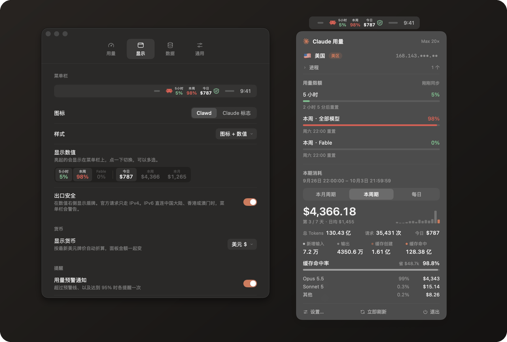
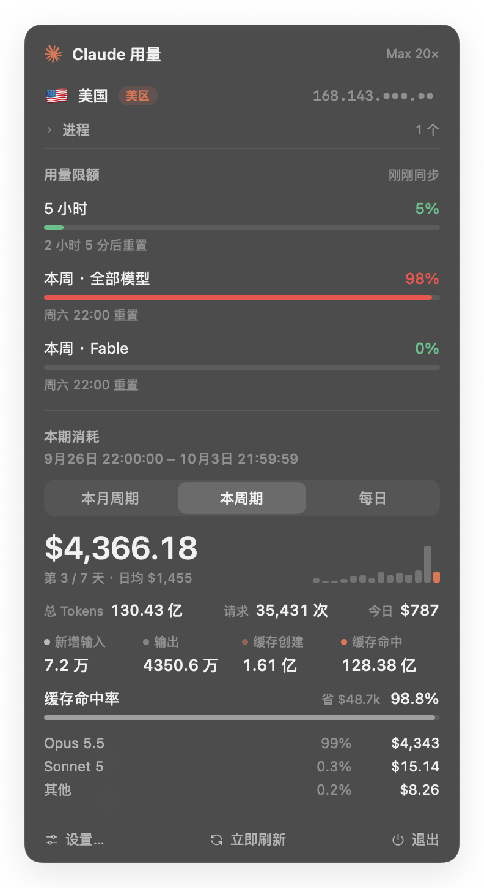
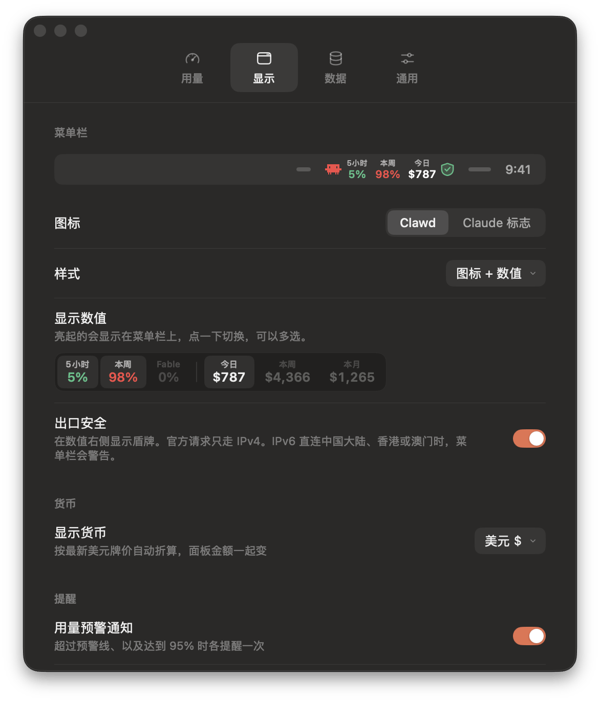
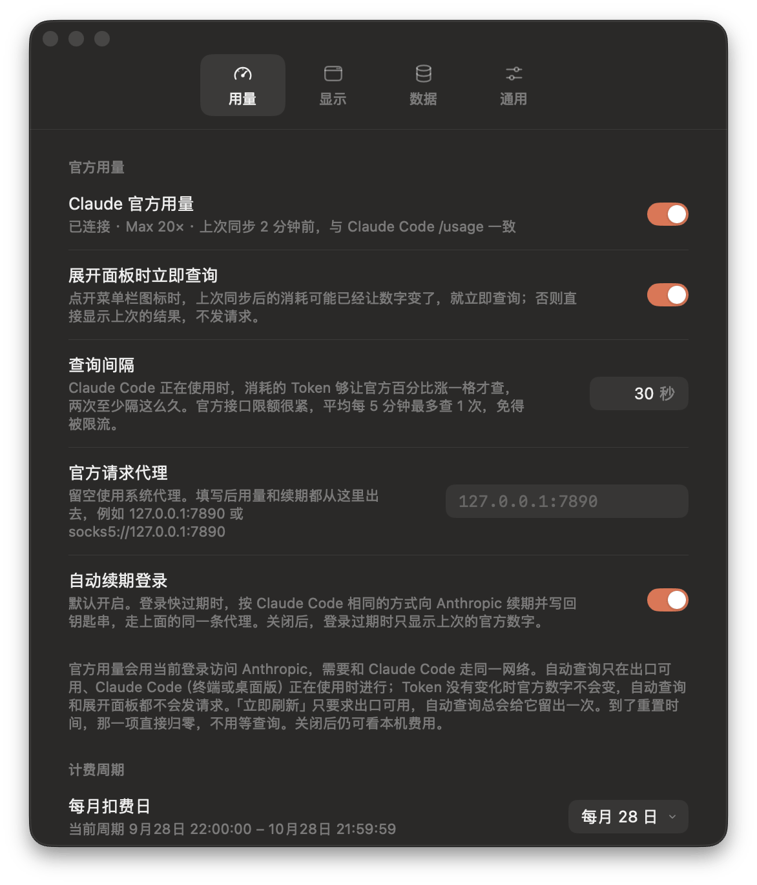

<div align="center">


# Claude Usage Monitor

**把 Claude 的准确额度，放进菜单栏。**

与 Claude Code `/usage` 完全相同的 5 小时与每周额度，边用边更新；<br>
再加上本机 Claude Code 会话按 API 价格折算的花费。原生、私密、安静。

[](https://github.com/kittors/claude-usage-monitor/releases/latest)
[](#安装)
[](Package.swift)
[](LICENSE)

[**下载**](https://github.com/kittors/claude-usage-monitor/releases/latest) · [English](README.md) · [更新日志](CHANGELOG.md)

<br>



</div>

<br>

## 亮点

<table>
<tr>
<td width="50%" valign="top">

**只用官方数字，从不估算**<br>
5 小时、每周和按模型的额度，直接来自 Claude Code `/usage` 背后的接口，取整方式也一样。

</td>
<td width="50%" valign="top">

**菜单栏上一眼看懂**<br>
默认只显示 5 小时；也可以加上本周、Fable、费用。每个数值一列、上方有小标签，按占用程度上色。

</td>
</tr>
<tr>
<td valign="top">

**该查的时候才查**<br>
只在 Claude Code 正在使用时查询，节奏跟着 Token 消耗走，两次之间至少隔 10 秒；有新用量时点开面板立即刷新。

</td>
<td valign="top">

**看得清出口**<br>
每次请求前确认 Anthropic 看到的出口；在中国大陆、香港、澳门时暂停，IPv6 直连时发出警告。

</td>
</tr>
<tr>
<td valign="top">

**花费一目了然**<br>
本周、本月周期或当天的 API 等价费用，外加 Token 构成、缓存节省、按模型拆分和近 14 天趋势。

</td>
<td valign="top">

**登录一直有效**<br>
按 Claude Code 完全相同的方式、使用同样的锁续期登录，数字不会断档；还能看到正在运行的 Claude 会话。

</td>
</tr>
</table>

## 截图

<table>
<tr>
<td width="40%" align="center" valign="top">
<br>
<sub><b>面板</b> · 额度、花费与进程</sub>
</td>
<td width="60%" align="center" valign="top">
<br>
<sub><b>设置 › 显示</b> · 选择菜单栏上显示什么</sub>
</td>
</tr>
<tr>
<td colspan="2" align="center">
<br>
<sub><b>设置 › 用量</b> · 什么时候查、代理、自动续期</sub>
</td>
</tr>
</table>

## 安装

在[最新版本](https://github.com/kittors/claude-usage-monitor/releases/latest)下载 `ClaudeUsageMonitor-<版本>-macOS.zip`，解压后把 **Claude Usage Monitor.app** 拖进「应用程序」。需要 macOS 15 或更高版本。

安装包没有经过公证，第一次打开可能被拦截。到「系统设置 › 隐私与安全性」里点「仍要打开」，或者运行：

```bash
xattr -dr com.apple.quarantine "/Applications/Claude Usage Monitor.app"
```

要显示额度，先在这台 Mac 上登录一次 Claude Code（`claude auth login`），之后应用会自己找到登录。新版本可以在「设置 › 通用」里一键更新。

## 工作方式

<details>
<summary><b>额度来自 Claude，而不是推算</b></summary>
<br>

应用从钥匙串读取 Claude Code 的登录，请求 `GET https://api.anthropic.com/api/oauth/usage`，也就是 Claude Code `/usage` 用的接口。百分比同样向下取整：71.9% 显示为 71%。同步失败时继续显示上次的官方数值并注明获取时间；还从未成功同步时，面板说明原因，百分比留空。

</details>

<details>
<summary><b>什么时候查询</b></summary>
<br>

这个接口有频率限制：每分钟请求一次，连续十几次后就会返回 HTTP 429。自动查询只在 Claude Code 正在使用时进行，也就是终端或桌面版里有会话在运行，并且最近 5 分钟内有新的 Token 消耗。还要求上次同步后 Token 有变化：没有变化时官方数字不会变，任何频率下都不发请求。频率在「设置 › 用量 › 自动查询」里选：

- **按 Token 消耗**（默认）：上次查询之后新增的消耗按 API 价格折算满 $0.50 就查；一直在消耗时最长 2 分钟查一次；消耗停下 15 秒后再补查一次。
- **固定间隔**：每 10 秒、30 秒、1 分钟、2 分钟或 5 分钟检查一次，Token 有变化才查询。间隔越短越容易被限流。

Claude Code 正在使用时，窗口到达重置时间、启动、从睡眠唤醒、出口恢复可用也会查一次。点开面板时，如果上次同步后有新的 Token 消耗就立即查询（「展开面板时立即查询」，默认开启）；没有新消耗时数字不会变，不发请求。它和「立即刷新」一样只要求出口可用，刷新图标会一直转到新结果出来。任意两次请求至少间隔 10 秒，遇到 429 会退避 5 到 30 分钟。

</details>

<details>
<summary><b>出口检查</b></summary>
<br>

每次请求前，应用都会用这次请求要走的同一条连接，询问 `api.anthropic.com` 看到的出口。检查失败，或出口在中国大陆、香港、澳门，就什么都不发。官方请求只走 IPv4。如果连到 Claude 的 IPv6 从这些地区直连出去，面板和菜单栏会显示严重警告。路由、网卡或系统代理变化时会再查一次，网络没变时不轮询。安全出口重新确认时，菜单栏盾牌变成红色，里面转一段短弧。风险出口保持警示，直到新结果出来。

</details>

<details>
<summary><b>登录续期</b></summary>
<br>

Claude Code 的 access token 大约 8 小时过期，只有 Claude Code CLI 会续期。桌面版用的是另一套登录，所以一直不跑 CLI 的话，钥匙串里的这份登录会失效。开启「自动续期登录」（默认开启）后，应用会在过期前大约 5 分钟，按 Claude Code 完全相同的方式续期：

- 使用相同的锁（`~/.claude/.oauth_refresh.lock`、`~/.claude.lock`、`~/.claude/.storage-write.lock`），不会和 Claude Code 同时续期。
- 续期会让旧的 refresh token 失效，所以先确认钥匙串条目能写回，写完再读回核对。
- 只替换 `claudeAiOauth` 里的令牌，条目里的其他内容（包括 MCP 服务器的登录）保持原样。
- 如果期间 Claude Code 已经续期或重新登录，应用保留它的结果。

登录本身也有有效期，设置页会显示日期。到期或在别处退出后，面板会提供「在终端中登录 Claude Code」，运行 `claude auth login`。

</details>

<details>
<summary><b>花费与 Token</b></summary>
<br>

增量解析 `~/.claude/projects/**/*.jsonl` 下的会话日志，包括子 Agent 日志。

- 同一条流式消息会写成多行，中间行的 `output_tokens` 只是部分值。按 `message.id + requestId` 去重，保留最终值。
- 按官方价目折算：5 分钟缓存写入 1.25 倍、1 小时缓存写入 2 倍，缓存读取按各模型单价。
- 结果与 Claude Code 自己的 `cost-state` 记录一致。

本周跟随官方每周额度的 `resets_at`，精确到秒；本月周期用你设置的扣费日，时刻相同；当天是本地自然日。这些日志只包含这台 Mac 上的 Claude Code，网页版、手机端和其他电脑的用量仍会体现在官方百分比里。

</details>

## 隐私

- 登录凭据只留在内存里，只发给 Anthropic：`api.anthropic.com` 取用量，`platform.claude.com` 续期登录，从不写进日志。
- 钥匙串条目 `Claude Code-credentials` 通过 `/usr/bin/security` 读写，与 Claude Code 相同。这个条目只信任 `security`，而 Claude Code 每次改写都会重置其他 App 的授权；改用钥匙串 API 的话，每次续期后都会再弹一次密码框。
- 关掉自动续期后，应用对登录只读不写。
- 会话日志从不离开这台 Mac。

## 从源码构建

需要 macOS 15 或更高版本，以及 Xcode 16 或更高版本（Swift 6 工具链）。

```bash
make app       # 构建 build/Claude Usage Monitor.app（release）
make install   # 构建并安装到 /Applications
make run       # 构建并启动
make dev       # 调试构建，并打开面板
make test      # 单元测试
make dist      # 打包发布用的 zip
```

构建脚本有 Apple Development 证书时用它签名，没有时用 ad-hoc 签名，可以用 `CODESIGN_IDENTITY` 指定。「登录时自动启动」使用 `SMAppService`，建议先 `make install` 再开启。

<details>
<summary><b>发版</b></summary>
<br>

1. 在 `CHANGELOG.md` 顶部新增 `## [x.y.z] - YYYY-MM-DD` 一节（英文）。
2. 运行 `make release VERSION=x.y.z`：跑测试、更新版本号、打 tag 并推送。
3. `.github/workflows/release.yml` 根据 tag 构建 zip，用 CHANGELOG 中对应的一节发布 Release。

</details>

<details>
<summary><b>性能</b></summary>
<br>

首次启动会为全部日志建立索引，5 GB、约 84 万行大约 5 秒。之后：

- 索引以紧凑的二进制格式保存在 `~/Library/Application Support/ClaudeUsageMonitor/`，加载约 20 毫秒。
- FSEvents 监听日志目录，只读取新增的字节，每次更新约 40 毫秒。
- 计算花费约 60 毫秒；Claude Code 清理旧日志后，索引里的历史仍然保留。

</details>

<details>
<summary><b>项目结构</b></summary>
<br>

```
Sources/
  UsageCore/                 数据层（无 UI，可单元测试）
    TokenParser.swift        JSONL 增量解析、ISO 8601 快速解析
    UsageIndex.swift         去重、会话元数据、文件游标、二进制缓存
    UsageCalculator.swift    本周、本月周期、当天、每日趋势
    OfficialUsage.swift      官方用量接口的模型
    AutoSync.swift           什么时候查询官方用量
    ClaudeOAuth.swift        凭据解析、续期请求、写回合并
    CredentialRenewal.swift  加锁、复查、写回预检、读回核对
    DirectoryLock.swift      与 Claude Code 兼容的目录锁
    Pricing.swift            模型价目表
    Formatting.swift         数字单位、货币、倒计时
  ClaudeUsageMonitor/        菜单栏 App
    App/                     状态栏图标、面板、图标绘制、设置窗口
    Services/                偏好设置、索引、官方用量、钥匙串、登录、进程、更新
    Design/                  配色、SVG 渲染、图标、Claude 标志与 Clawd
    Views/                   面板与设置页
Tests/UsageCoreTests/        解析、去重、定价、窗口、用量 JSON、登录续期、查询时机
Scripts/                     构建 .app、发版打 tag
.github/workflows/           CI 与发版
```

</details>

## 许可

代码以 [MIT](LICENSE) 许可发布。Claude 标志与 Clawd 吉祥物为 Anthropic 的商标，不在该许可范围内。本项目与 Anthropic 无关。
